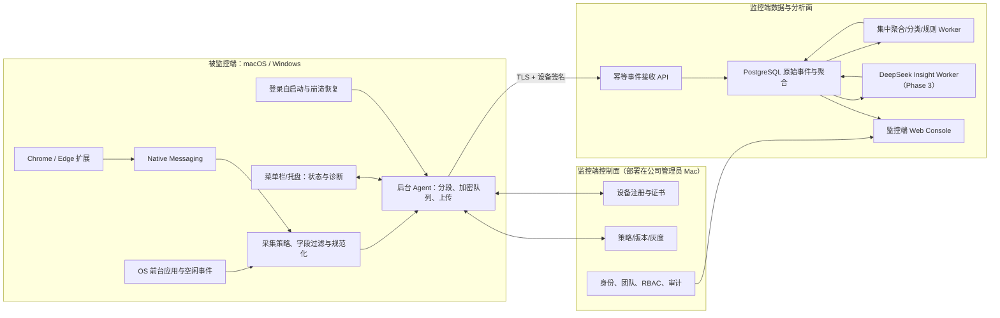

# 系统上下文（System Context）

> 版本：v1.0

## 参与者

- **公司管理员（Admin）**：创建组织/团队、设置策略、查看组织汇总、查看个人明细（需审计）、管理模型与导出。
- **团队主管（Manager）**：查看授权团队的汇总与趋势。
- **内部审计（Auditor）**：查看审计日志、按审计范围查看数据。
- **IT 运维（Operator）**：查看 Agent 在线、版本、权限、上传与升级状态（仅健康数据）。
- **被监控员工**：不是监控端必需角色；个人查看页按公司策略决定。
- **DeepSeek API**：监控端唯一模型 Provider（Phase 1 不接入，Phase 3 接入）。

## 系统组件

## 部署拓扑（Phase 1/2）

- 监控端：公司管理员 Mac 本机运行 `api`、`worker`、PostgreSQL（Docker）；Web Console 同机。
- 被监控端：公司设备清单中的 macOS 13+ / Windows 11 电脑。
- 网络：公司内网或可达管理员 Mac 的网络；TLS + 设备签名。
- 无 MDM/SSO：MVP 使用内置账号、手动映射、手动分发。

## 数据流

1. OS 事件与浏览器事件 → 本地过滤 → 分段合并 → 加密 SQLite 队列 → 批量上传。
2. API 校验 Schema、幂等去重 → 写入 `activity_events_raw` / `activity_segments`。
3. Worker 日聚合 → 分类（规则优先）→ 规则事实 → （Phase 3）DeepSeek Insight。
4. Web Console 查询聚合与明细（明细需授权 + 审计）。
5. 保留作业按策略清理，写删除证明。
