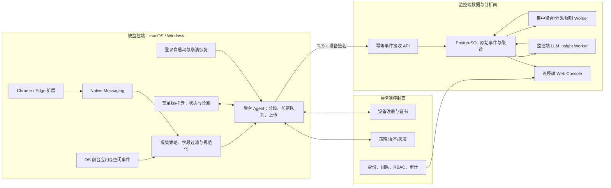
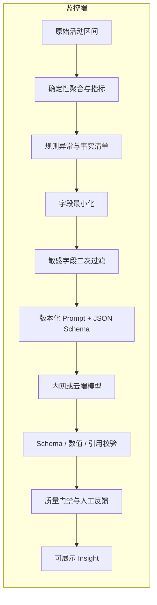

# macOS / Windows 终端使用与浏览分析系统

## 全网项目调研、方案对比与完整实施计划

> 文档版本：v1.1  
> 调研日期：2026-08-10  
> 工作模式：Product（新产品、跨平台终端、系统权限、终端数据、集中分析）  
> 当前状态：仅完成公开资料调研与本地方案文档；尚未初始化仓库、写代码、构建、签名、部署或接入真实用户数据。  
> 目标目录：`/Users/yancyfeng/Desktop/Mac Dpxx项目/自研软件/电脑监控软件`  
> v1.1 确认项：公司内部使用；所有业务分析和大模型推理位于监控端；被监控端默认后台自启动。

---

## 0. 结论先行

推荐做成一套**公司内部、集中分析、可运维审计的终端使用监控系统**。系统包含：

1. **被监控端（Endpoint Agent）**：安装在 macOS 和 Windows；安装并完成首次配置后，默认随用户登录自动启动、在后台常驻且不弹主窗口。它只做事件采集、字段过滤、区间合并、加密缓存、上传和健康上报，不做分类、统计、规则分析或大模型推理。
2. **浏览器扩展（Browser Extension）**：首期支持 Chrome 和 Edge，只记录当前活动标签页的域名、标题与停留时间；通过 Native Messaging 交给本机 Agent。
3. **监控端（Server + Web Console）**：接收并保存事件，管理设备、采集策略、权限、团队汇总、个人时间线、审计记录和 AI 洞察。
4. **监控端分析层（Aggregation + Rules + LLM）**：全部部署在监控端。先由确定性代码完成统计、分类和规则事实，再把必要的汇总数据交给大模型生成解释和建议。Agent 不包含模型运行时、Prompt、模型密钥或业务分析逻辑。

### 推荐技术路线

- 终端 Agent：**Rust 核心 + Tauri 2 托盘/菜单栏外壳 + 平台适配层**；默认后台启动，主窗口按需打开。
- macOS 采集：`NSWorkspace` 获取前台应用；只有策略允许且用户授予辅助功能权限时才获取窗口标题。
- Windows 采集：`SetWinEventHook(EVENT_SYSTEM_FOREGROUND)`、`GetWindowTextW`、`GetWindowThreadProcessId`、`GetLastInputInfo`。
- 浏览器：Manifest V3 WebExtension；Chrome/Edge 共用一套核心代码；使用 Native Messaging，不开放未经认证的本地 HTTP 端口。
- 服务端：**TypeScript 模块化单体 + 独立 Worker + PostgreSQL**；MVP 不引入 Kafka、ClickHouse、Kubernetes 等重型组件。
- 管理端：Next.js/React + TypeScript；按公司组织、角色和团队控制可见范围。
- AI：模型 Provider 抽象；确定性分析、分类、脱敏和模型调用全部运行在监控端，Provider 可接公司内网模型或云端模型。
- 部署：公司内部优先采用内网私有部署或单租户部署；模型密钥只存在监控端密钥系统。

### 不建议的路线

- 不建议把 ActivityWatch 整套代码直接作为商业产品底座。
- 不建议把 Fleet、Wazuh 或 Velociraptor 改造成员工活动分析产品。
- 不建议 MVP 采集截图、录屏、音频、摄像头、键盘内容、剪贴板、聊天内容、邮件正文、网页正文或表单输入。
- 后台常驻不等于隐蔽运行：不设计绕过系统权限、反卸载、远程任意命令执行或伪装系统进程。

---

## 1. 前提、范围与必须确认的产品假设

本计划为了能够落地，先采用以下明确假设。任何一项不成立，都应先改产品合同，再进入编码。

### 1.1 当前假设

- 首要场景是**公司内部的自有或统一受管办公电脑**。
- 监控端使用者包括公司管理员、团队主管、IT 运维和内部安全审计人员。
- 被监控端默认随当前用户登录自动启动并在后台常驻；正常启动不弹主窗口，菜单栏/托盘仅用于状态、诊断和必要设置。
- 被监控端不做业务分析：不计算生产力分数、不做应用/网站业务分类、不运行规则洞察、不内置或调用大模型。
- 所有汇总、分类、趋势、异常、报告和大模型分析都在公司监控端完成。
- 首期只覆盖 macOS 与 Windows；不做手机、Linux、网络网关或路由器级抓包。
- 首期浏览器为 Chrome 与 Edge；Firefox 放在第二阶段，Safari 放在第三阶段。
- 首期重点是“使用了什么应用/网站、持续多久、如何形成工作节奏”，不是内容审查或数据防泄漏（DLP）。
- 首期管理端为 Web，不另外做管理端原生 App。
- 大模型输出必须附带可核对的统计证据；最终使用方式由公司内部管理规则决定。
- 模型密钥、Prompt 和 Provider 配置只存在监控端，不下发到 Agent 或浏览器扩展。

### 1.2 如果真实目标是以下场景，需要单独立项

- 家长控制未成年人设备；
- BYOD 私人电脑或公司无法统一管理的设备；
- 涉密、金融、医疗或关键基础设施环境；
- 屏幕录制、OCR、即时通信审计或 DLP；
- 远程控制、远程命令、文件取证；
- 基于个人行为直接控制工资、门禁或终端权限；
- 面向外部客户的多租户 SaaS。

这些场景的权限、威胁模型、架构和验收标准不同，不能在当前内部 MVP 上“顺便加”。公司制度和其他非技术事项不属于本版计划范围。

---

## 2. 调研方法与资料可信度

本次优先使用项目官方仓库、官方文档及 Apple/Microsoft/Chrome/Mozilla 官方平台文档。商业产品能力以厂商官方页面为准，仅用于功能定位对比，不代表独立测评结果。

评估维度：

- 是否覆盖 macOS/Windows；
- 能否记录前台应用、窗口标题、浏览器活动标签页和空闲状态；
- 是否支持 Agent 注册、策略下发、离线队列、升级与健康检查；
- 是否支持多租户、RBAC、审计、受控导出和保留策略；
- 隐私默认值是否适合企业使用；
- 许可证是否适合复用；
- 维护、打包、签名和二次开发成本；
- 能否安全接入大模型，而不把敏感原始数据直接暴露给模型。

---

## 3. 可参考项目与产品对比

### 3.1 核心对比表

| 项目/产品 | 核心能力 | 可参考内容 | 主要缺口/风险 | 建议 |
| --- | --- | --- | --- | --- |
| [ActivityWatch](https://github.com/ActivityWatch/activitywatch) | 开源、跨平台、本地优先的应用/窗口/浏览器活动记录 | Watcher 分离、Bucket/Event/Heartbeat 模型、本地 SQLite、时间线、分类、自有数据理念 | 面向个人本机使用；多租户、企业 RBAC、集中策略、审计、集中数据治理和升级并非其核心；MPL-2.0 需逐文件履约 | **最重要的产品与数据模型参考；先参考，不直接整套 fork** |
| [aw-watcher-window](https://github.com/ActivityWatch/aw-watcher-window) | macOS/Windows/Linux 前台应用与窗口标题采集 | 平台差异、轮询/事件混合、权限失败降级 | Python 打包常驻成本；macOS 标题依赖辅助功能权限；MPL-2.0 | 用于技术验证和测试用例对照，不复制实现前先做许可证审查 |
| [aw-watcher-web](https://github.com/ActivityWatch/aw-watcher-web) | Chrome/Edge/Firefox 当前标签页、标题、URL、隐私模式状态 | WebExtension 事件处理、浏览器兼容、活动标签页语义 | 其设计面向本地 ActivityWatch 服务；企业分发、身份绑定、策略签名需重做；MPL-2.0 | 参考事件语义和浏览器边界；自研扩展更清晰 |
| [osquery](https://github.com/osquery/osquery) | 用 SQL 查询 macOS/Windows/Linux 系统状态 | 设备/软件/进程库存、扩展机制、定时查询 | 不负责可靠记录“当前前台应用和活动标签页时长”；许可证含多种文件边界 | 可作为未来设备库存可选集成，不是活动采集核心 |
| [Fleet](https://github.com/fleetdm/fleet) | 基于 osquery 的集中设备管理、Agent 配置、查询、更新 | 设备注册、Host identity、策略分组、Agent health、升级通道、GitOps 思路 | 不采集私人活动；官方明确不采集按键、邮件、摄像头等；Open Core 边界 | **重点参考 Agent 生命周期和集中管理，不作为核心代码底座** |
| [Wazuh](https://github.com/wazuh/wazuh) | XDR/SIEM、Agent、库存、告警、漏洞与完整性监控 | Agent 注册、系统库存、浏览器扩展库存、集中报告 | 栈重、偏安全事件，不是注意力/使用时长分析；GPLv2 及组件许可证边界需核验 | 仅参考安全运维和资产库存；不嵌入 MVP |
| [Velociraptor](https://github.com/Velocidex/velociraptor) | 终端取证、VQL、远程采集、Artifact | 大规模客户端通信、离线与限流、取证审计思路 | 权限和能力远超本产品，容易形成远程取证/控制面；许可证需单独核验 | 作为“不要把 MVP 做成取证平台”的边界参照 |
| [RescueTime](https://www.rescuetime.com/) | 商业个人/团队应用与网站时间分析 | 单一活动原则、自动时间线、分类、周报、目标与提醒 | 非开源；偏个人效率；集中管理和企业数据治理有限 | 参考轻量 UX、分类和个人洞察 |
| [Hubstaff](https://hubstaff.com/how-tracking-works) | 商业工时、应用/URL、可选截图、团队报告 | 明示正在记录、用户控制、个人数据可见、按角色设置、可删除敏感记录 | 截图/活动率可能引发过度监控风险 | 参考透明度与权限设计；默认不做截图 |
| [ActivTrak 隐私控制](https://support.activtrak.com/hc/en-us/articles/360053092432-How-ActivTrak-Respects-Employee-Privacy) | 团队活动分析与隐私设置 | 默认隐藏详细 URL、标题、屏幕图像；RBAC；不做键盘记录 | 商业闭源；实际能力需采购验证 | **重点参考 privacy-by-default 与团队汇总** |
| [Teramind](https://www.teramind.co/features/internet-use-monitoring/) | 深度网页、录屏、OCR、通信和键盘监控 | 说明市场上“高侵入监控”的能力上限 | 权限、信任、安全、存储和数据泄露风险极高 | 作为反面边界；当前产品明确不走此路线 |
| [Tauri](https://github.com/tauri-apps/tauri) | Rust + 系统 WebView 的跨平台桌面框架 | 托盘、安装包、Updater、Rust 核心、较小体积 | 平台权限仍需原生适配；macOS/Windows 必须各自在原生 Runner 构建验证 | 推荐作为可见 Agent 外壳，但先做两平台可行性薄切片 |
| [Microsoft Presidio](https://github.com/microsoft/presidio) | PII 检测与匿名化 | 模型前脱敏、可定制识别器、结构化数据处理 | 无法保证找出全部敏感信息，不能作为唯一保护层 | 作为服务端辅助脱敏；前置字段最小化仍是主控制 |
| [Ollama Structured Outputs](https://docs.ollama.com/capabilities/structured-outputs) / [vLLM](https://github.com/vllm-project/vllm) | 本地/私有模型与结构化输出 | 私有部署、JSON Schema 输出、OpenAI 兼容接口 | 需要硬件、模型评估、更新和安全运维 | 私有化选项；不在 MVP 初期绑定唯一模型 |

### 3.2 ActivityWatch 最值得借鉴的四点

1. **Watcher 解耦**：应用窗口、浏览器、空闲状态分别采集，故障和权限互不拖累。
2. **事件 + 持续时间**：事件包含开始时间、持续时间和数据，而不是每秒写一行。
3. **Heartbeat 合并**：相邻相同状态在时间窗口内合并，显著降低磁盘和网络写入。
4. **本地优先与自我可见**：终端先持久化、离线可用，用户能看到自己收集了什么。

ActivityWatch 官方数据模型将活动按 Bucket 区分来源，事件结构为 `timestamp + duration + data`，相邻相同事件可通过 heartbeat 合并，见[官方数据模型](https://docs.activitywatch.net/en/latest/buckets-and-events.html)。本项目应保留这些思想，但改为强类型版本化事件、公司组织边界、设备序列号、幂等写入和审计可追溯。

### 3.3 Fleet/Wazuh 最值得借鉴的内容

- 设备一次性注册与长期设备身份分离；
- 策略按公司/团队/设备分组，带版本和签名；
- Agent 心跳、在线状态、版本、升级通道和失败原因；
- 控制面与数据面分离；
- 远端配置有回滚、冷却和灰度；
- 系统/软件库存作为独立模块，而不是混入活动事件。

### 3.4 商业产品给出的产品启示

- RescueTime 的“只记录当前正在交互的一项活动”比扫描所有后台进程更符合使用时长语义。
- Hubstaff 强调用户知道何时开始/停止记录、能查看自身数据，说明透明度本身就是产品能力。
- ActivTrak 的默认隐藏详细 URL、标题和图像值得采用：管理者默认先看团队汇总，个人细节需要更高权限并被审计。
- Teramind 展示了功能膨胀的风险：一旦加入录屏、OCR、即时消息或键盘记录，产品从“使用分析”变成“内容监控与取证”，必须重新设计采集、权限、存储和安全架构。

---

## 4. 三种实施路线

| 路线 | 做法 | 优点 | 缺点 | 结论 |
| --- | --- | --- | --- | --- |
| A. ActivityWatch 深度改造 | Fork Agent、Server、Web UI，再增加云同步、租户、RBAC、AI | 最快看到单机数据；已有采集经验 | 架构目标不同；Python/Rust/Vue 多仓协作；企业能力几乎都要重做；MPL 文件级义务需要持续管理 | 仅适合 1–2 周 PoC，不适合直接成为长期商业底座 |
| B. 自研 Agent + 借鉴事件语义 | Rust/Tauri Agent、WebExtension、模块化服务端和 Web Console | 边界清晰、长期维护一致、易做字段最小化、设备身份与组织权限 | 前 6–10 周基础设施工作更多；两平台适配与签名需要真实环境 | **推荐** |
| C. Fleet/Wazuh/Velociraptor 上叠加 | 使用现成 Agent 管理，再增加自定义采集/仪表盘/AI | 设备管理和安全运维能力成熟 | 栈过重；前台活动和浏览器语义仍需自研；权限面过大；产品体验割裂 | 未来企业集成选项，不作为 MVP 主线 |

### 推荐决策

选择 B，但在第一个技术薄切片中，用 ActivityWatch 作为对照基准：同一台 Mac/Windows 同时运行我们的 PoC 与 ActivityWatch，比较前台切换、空闲识别、睡眠唤醒和浏览器活动的完整性与资源占用。只比较输出，不复制代码。

---

## 5. 产品合同

### 5.1 用户问题

组织缺少可信、低侵入的证据来回答：

- 办公电脑时间主要花在哪些应用和网站类别；
- 深度工作、沟通、会议、检索和频繁切换的模式是什么；
- 工具采用、流程瓶颈和异常使用发生在哪里；
- 如何给员工本人和管理者提供可行动的改进建议，而不是靠主观印象。

### 5.2 目标用户

- 公司管理员：注册公司组织、部署设备、设置策略和保留期；
- 团队主管：查看被授权团队的汇总与趋势；
- 内部审计人员：查看谁访问过什么数据、核对管理员操作与导出记录；
- IT 运维：看 Agent 在线、版本、权限、上传失败与升级状态。

被监控员工不是监控端的必需用户角色；是否开放个人查看页由公司策略决定，不影响采集和集中分析主链路。

### 5.3 MVP 主路径

```text
管理员创建组织与采集策略
  → 生成一次性设备注册码
  → IT 在公司电脑安装 Agent 并完成首次配置
  → Agent 注册登录启动项并申请必要系统权限
  → 后续登录时 Agent 默认在后台启动，不弹主窗口
  → Chrome/Edge 扩展与 Agent 配对
  → 被监控端采集、字段过滤、区间合并和离线排队
  → 加密上传并获得幂等确认
  → 监控端 Worker 聚合、分类并形成规则事实
  → 监控端 LLM 基于汇总生成带证据的分析
  → Web Console 展示个人/团队数据、设备状态和 AI 报告
  → 授权管理员可修正分类、导出或按内部策略删除数据
```

### 5.4 MVP 必须完成

- macOS/Windows 前台应用和使用时长；
- macOS/Windows 用户登录后默认后台启动、单实例运行、崩溃受控恢复；
- 空闲、锁屏、睡眠与唤醒处理；
- Chrome/Edge 活动标签页域名、标题、时长；
- 本地策略、敏感域名过滤、离线队列和重试；
- 设备注册、吊销、健康与版本；
- 公司组织/用户/团队/RBAC；
- 监控端日时间线、应用/网站分类、团队汇总；
- 管理员审计日志、受控导出和数据清理；
- 监控端日/周 AI 分析，输出可追溯到聚合统计；
- 自动测试保证 Agent 包不包含模型密钥、Prompt、模型权重或业务分析模块；
- macOS 和 Windows 本地签名测试包；正式签名、公证和远端发布另设门禁。

### 5.5 MVP 明确不做

- 截图、连续录屏、摄像头、麦克风；
- 逐键记录、键盘内容、剪贴板；
- 网页正文、DOM、表单输入、密码、Cookie；
- 邮件/聊天正文、文件内容、文件上传内容；
- 私密/无痕浏览；
- 网络抓包、中间人解密、HTTPS 内容拦截；
- 远程桌面、远程 Shell、任意脚本执行；
- 绕过 TCC/UAC/浏览器授权、伪装系统进程、未经签名的反卸载能力；
- 端侧分类、端侧统计报告、端侧大模型或模型 Provider 密钥。

---

## 6. 分阶段功能范围

| 能力 | MVP | Pilot | 正式版/后续 | 禁止/另立项 |
| --- | --- | --- | --- | --- |
| 前台应用与时长 | 是 | 完善 | 是 | — |
| 窗口标题 | 策略开关，默认脱敏 | 敏感 App 规则 | 细粒度模板 | — |
| Chrome/Edge 域名与标题 | 是 | 企业策略分发 | 是 | — |
| 完整 URL path/query | 默认不采 | 仅白名单场景试验 | 公司技术负责人批准后可选 | 禁止默认开启 |
| Firefox | 否 | 是 | 是 | — |
| Safari | 否 | 技术验证 | 是 | — |
| 空闲/锁屏/睡眠 | 是 | 完善 | 是 | — |
| 登录后后台自启动 | 是，默认开启 | MDM/企业策略 | 是 | 交互采集器做成 SYSTEM 服务禁止 |
| 异常退出恢复 | 有界重启 | 健康告警 | 灰度与阻断 | 无限崩溃循环禁止 |
| 本地暂停/退出 | 公司策略决定 | 记录状态 | 可受管配置 | 不伪造在线状态 |
| 团队汇总 | 是 | 完善 | 是 | — |
| 个人明细 | 授权管理角色 | 访问审计 | 是 | 全员互看禁止 |
| AI 日/周总结 | 是 | 评估与灰度 | 是 | 自动人事决策禁止 |
| 应用/网站分类 | 监控端规则优先 | 监控端模型建议 + 人审 | 组织词典 | Agent 端分类禁止 |
| Agent 端业务分析/LLM | 否 | 否 | 不规划 | 禁止 |
| 截图/录屏/OCR | 否 | 否 | 另立项 | 当前范围禁止 |
| 键盘/聊天/邮件正文 | 否 | 否 | 不规划 | 禁止 |
| 设备库存 | 基础 OS/版本 | 可选 osquery/Fleet 集成 | 是 | — |
| 自动更新 | 手动测试 | 签名灰度 | 是 | 无签名更新禁止 |

---

## 7. 数据最小化合同

### 7.1 数据采集矩阵

| 数据 | 默认 | 精度/示例 | 本地处理 | 服务端用途 | 默认保留 |
| --- | --- | --- | --- | --- | --- |
| 设备身份 | 采集 | 随机 `device_id`、OS、Agent 版本 | 不上传硬盘序列号等强标识 | 注册、健康、版本 | 设备存续期 + 30 天 |
| 用户身份 | 采集 | 公司内 `subject_id` | 与本机用户名分离；监控端受控映射 | 权限与员工数据 | 在职/授权期 |
| 前台应用 | 采集 | bundle id / process id / 产品名 | 规范化、敏感 App 黑名单 | 使用时长分类 | 原始 30 天，聚合 365 天 |
| 窗口标题 | 默认受限 | 最长 256 字符 | 邮箱、文档名、账号等模式脱敏；敏感 App 可整段丢弃 | 精细分类与本人时间线 | 原始 7–30 天 |
| 浏览器域名 | 采集 | `registrable_domain`，如 `example.com` | 去协议、端口、path、query、fragment | 网站分类与时长 | 原始 30 天，聚合 365 天 |
| 完整 URL | 默认不采 | 仅白名单可保留 path；永不保留 query/fragment | 先本地规则过滤 | 特殊业务分析 | 默认 0 天 |
| 标签页标题 | 默认受限 | 最长 256 字符 | 敏感规则和 PII 脱敏 | 分类/个人查看 | 原始 7–30 天 |
| 空闲状态 | 采集 | active/idle/locked | 不采具体按键或鼠标位置 | 排除离席时间 | 30 天后只留聚合 |
| 设备健康 | 采集 | 队列深度、最后上传、权限状态、CPU/内存分位数 | 日志脱敏 | 运维 | 30–90 天 |
| 私密/无痕状态 | 只用于丢弃 | true 时不形成活动事件 | 本地立即丢弃 | 不上传 | 0 天 |
| 截图/录屏 | 不采 | — | — | — | 0 天 |
| 键盘、剪贴板、网页正文、表单、聊天、邮件正文 | 不采 | — | — | — | 0 天 |

默认期限是内部产品初始值，由公司管理员根据存储容量和业务需要配置；后台设置必须有明确上限，不能无限期保留。

### 7.2 本地敏感过滤顺序

```text
系统/浏览器事件
  → 私密模式判断（命中即丢弃）
  → 敏感应用/域名整段屏蔽
  → URL 规范化，只取 registrable domain
  → 标题长度限制
  → 本地 PII/密钥/令牌/邮箱模式脱敏
  → 组织白名单/黑名单策略
  → 相邻事件合并
  → 加密本地队列
  → 上传
```

敏感类别至少包括：密码管理器、银行/支付、医疗健康、个人邮箱、政府身份服务、宗教、招聘求职、本地开发密钥页面、`localhost`/内网管理页面。管理员可以增加屏蔽规则，但不能远程取消“私密模式永不记录”的硬规则。

本地过滤、规范化和相邻事件合并属于采集前处理，不属于业务分析。Agent 不生成类别、趋势、评分、异常或自然语言报告。

### 7.3 终端状态与内部管理

- Agent 正常运行时不打开主窗口，以菜单栏/托盘图标表示运行、离线、权限异常和暂停状态；
- 首次配置页用于设备注册、权限引导和自启动状态确认；完成后默认后台运行；
- 个人时间线和 AI 报告只存在监控端，不在 Agent 本地生成；
- 管理员查看个人明细必须有角色授权并写入审计；
- AI 输出页面必须显示“统计依据、模型版本、生成时间、置信/限制、反馈入口”。

---

## 8. 总体架构



### 8.1 信任边界

1. 浏览页面和窗口标题都是不可信输入，可能包含个人信息、恶意提示词或超长文本。
2. 浏览器扩展不能直接访问服务端管理 API；只能通过白名单 Native Messaging Host 把有限事件交给 Agent。
3. Agent 只能使用设备级凭据上传本公司登记的设备事件，不能查询监控端数据。
4. 服务端接收层不信任 Agent 时间、版本、序号或字段长度；必须校验、限流和幂等处理。
5. LLM 是外部或半可信处理方，只得到脱敏后的聚合输入；LLM 输出也不可信，必须做 Schema、事实和政策校验。
6. 管理员也是潜在滥用角色；个人明细访问、导出、策略修改和删除都必须审计。
7. Agent 与浏览器扩展是纯数据采集面；监控端是唯一业务分析面。协议和 CI 必须阻止 Prompt、Provider 凭据、模型权重、评分规则或分析结果下发到 Agent。

---

## 9. 被监控端设计

### 9.1 进程模型

MVP 使用**每个登录用户一个默认后台常驻 Agent 进程**。安装并完成首次配置后注册登录启动项；以后用户登录时自动启动，正常启动不打开主窗口，仅保留菜单栏/托盘状态入口。采用该模型而不先做高权限系统服务，原因是：

- 前台窗口和空闲状态属于当前交互会话；
- Windows 服务位于非交互 Window Station，不能直接当作用户桌面采集器；
- macOS 权限授予与当前 App 身份、签名和 TCC 相关；
- 减少 root/SYSTEM 权限和被滥用面。

运行要求：

- 单实例，重复启动只唤醒现有进程；
- 登录后延迟 5–15 秒启动，避免与系统登录高峰争抢资源；
- 采集循环与托盘 UI 解耦，关闭设置窗口不终止 Agent；
- 意外崩溃采用指数退避和熔断，不能形成无限重启循环；
- 退出、自启动被关闭、权限被撤销都形成健康状态并上报监控端；
- 开机但无人登录时不采集；登录、锁屏、登出和快速用户切换严格按用户会话切段。

macOS 13+ 使用 `SMAppService` 注册 Login Item 或 LaunchAgent；Apple 官方说明其可在当前和后续登录启动，并可读取授权状态，见 [SMAppService](https://developer.apple.com/documentation/servicemanagement/smappservice) 与 [register()](https://developer.apple.com/documentation/servicemanagement/smappservice/register%28%29)。Windows 若采用 MSIX，使用 `windows.startupTask`；若采用 MSI/EXE，则由安装器注册当前用户的登录触发任务，见 [Windows Startup Task](https://learn.microsoft.com/en-us/windows/apps/desktop/modernize/desktop-to-uwp-extensions) 与 [Logon Trigger](https://learn.microsoft.com/en-us/windows/win32/taskschd/starting-an-executable-when-a-user-logs-on)。最终路径在打包薄切片后确定。

后续如确需机器级升级辅助程序，拆成权限极小的独立 Helper，只允许验证并安装签名更新，不能读取活动内容、执行分类或调用模型。

### 9.2 Agent 模块

- `collector-macos`：前台应用、标题（可选）、锁屏、睡眠/唤醒；
- `collector-windows`：前台窗口事件、标题、进程、当前会话空闲；
- `browser-bridge`：Native Messaging Host；
- `collection-policy`：签名策略验证、工作时段、屏蔽/脱敏、字段上限；只决定采不采和上传什么，不包含业务分类规则；
- `segmenter`：把状态变更合成不重叠的活动区间；
- `local-store`：SQLite 离线队列、ACK、水位和自动过期；
- `uploader`：压缩批量上传、退避、限流、幂等；
- `device-identity`：设备密钥、注册、轮换和吊销；
- `health`：权限、采集器状态、队列、资源占用、版本；
- `autostart-supervisor`：登录启动注册、单实例、崩溃退避、状态检测；
- `shell-ui`：菜单栏/托盘、后台状态、诊断、权限引导和按公司策略提供的暂停/退出入口。

Agent 依赖图中不得出现 `analytics`、`insight`、`llm`、模型 SDK 或模型 Provider 客户端。`segmenter` 只把状态变化变成可上传的时间区间，不计算分类、趋势、分数或报告。

### 9.3 macOS 能力与权限

- `NSWorkspace.frontmostApplication` 和激活通知用于前台 App；Apple 文档说明它代表接收键盘事件的最前端应用，见 [frontmostApplication](https://developer.apple.com/documentation/appkit/nsworkspace/frontmostapplication) 与 [didActivateApplicationNotification](https://developer.apple.com/documentation/appkit/nsworkspace/didactivateapplicationnotification)。
- 窗口标题可通过 Accessibility API 获取，但需要用户在系统设置授予辅助功能权限；拒绝时必须降级为只记录应用，不重复骚扰。
- 不申请屏幕录制权限，因为 MVP 不截图/录屏。
- 不申请 Full Disk Access，不读取浏览器历史数据库或其他 App 私有文件。
- 睡眠、唤醒、锁屏和用户切换时关闭当前区间，避免把睡眠算作使用时长。
- 使用 `SMAppService` 管理后台登录项并检查状态；被系统或用户关闭时在监控端设备健康页显示，不用脚本绕过系统设置。
- 正式企业分发需要 Developer ID 签名与公证；复杂分发可参考 Apple 的[公证工作流](https://developer.apple.com/documentation/security/customizing-the-notarization-workflow)。

### 9.4 Windows 能力与权限

- `GetForegroundWindow` 获取当前交互窗口；
- `SetWinEventHook` 监听 `EVENT_SYSTEM_FOREGROUND`，避免高频轮询；官方文档要求调用线程具有消息循环，且需要处理回调重入；
- `GetWindowTextW` 读取标题栏文本，获取不到时返回空标题并降级；
- `GetWindowThreadProcessId` 关联进程；
- `GetLastInputInfo` 只用于当前会话的空闲时间，不记录具体输入内容；
- Agent 运行在用户会话，不以 SYSTEM 服务读取桌面；Microsoft 文档明确说明非交互服务 Window Station 不能显示或直接作为交互桌面进程；
- 随用户登录后台启动：MSIX 路线使用 Startup Task，MSI/EXE 路线使用当前用户 Logon Trigger；进程启动后最小化到托盘，不弹主窗口；
- 正式包优先评估 MSIX 或签名 MSI/EXE；企业受管设备可通过 Intune/配置管理分发。所有正式安装包必须签名。

### 9.5 本地队列

- SQLite WAL；
- 事件 payload 在写盘前经过策略过滤；
- 敏感列使用应用层 AES-GCM envelope encryption；密钥存入 macOS Keychain / Windows DPAPI；
- 默认最多缓存 72 小时或 100 MB，先到者触发；
- 队列满时保留健康事件和最新有效区间，丢弃最旧区间并记录丢弃计数；Agent 不生成业务聚合；
- 服务端以 `device_id + sequence_no + event_id` 幂等确认；
- ACK 后按批次删除，不用“发出即删除”；
- 系统时钟回拨、时区变化和 DST 不修改 UTC 事实时间，另存客户端时区用于展示。

---

## 10. 浏览器扩展设计

### 10.1 MVP 支持

- Chrome Manifest V3；
- Edge 复用 Chromium 版本并单独验证/发布；
- 事件：`tabs.onActivated`、`tabs.onUpdated`、`windows.onFocusChanged`、浏览器启动/关闭、系统空闲/恢复；
- 只处理活动窗口的活动标签页；后台标签不累计时长；
- 默认采集 `title`、`registrable_domain`、浏览器类型；完整 URL 先在扩展/Agent 中截断；
- 私密/无痕上下文永不形成上传事件。

### 10.2 权限

- `tabs`：读取活动 Tab 的 URL/标题；Chrome 会显示“读取浏览历史”类权限提示，必须在安装前解释用途；
- `nativeMessaging`：与已安装 Agent 的白名单 Host 通信；
- `storage`：只存扩展状态和策略版本，不保存活动历史；
- 不申请 `<all_urls>` 内容脚本权限；
- 不申请 `webRequest`、Cookie、下载、剪贴板、摄像头、麦克风权限；
- 如果只靠 `tabs` 能完成当前活动标签页需求，就不注入 content script。

Chrome 官方说明 `tabs` 权限可访问 `Tab.url` 和 `Tab.title`，见[权限列表](https://developer.chrome.com/docs/extensions/reference/permissions-list)；Native Messaging 通过扩展 service worker 与白名单本机 Host 的 stdin/stdout 通信，见[官方文档](https://developer.chrome.com/docs/extensions/develop/concepts/native-messaging)。

### 10.3 为什么使用 Native Messaging

- 不需要在 `127.0.0.1` 开放常驻 HTTP 服务；
- Host manifest 可限制允许连接的扩展 ID；
- 浏览器负责启动通信进程与长度协议；
- Chrome、Edge、Firefox 都有相近模型；Safari 也提供包含 App 与扩展间的 Native Messaging；
- 更容易把浏览器数据绑定到当前 Agent/设备策略。

所有消息仍需版本、长度、枚举和字段白名单校验。Native Messaging 不是“自动可信”。

### 10.4 分发顺序

1. 开发期：本地 unpacked 扩展，仅测试设备；
2. 内部 Pilot：受管浏览器策略安装或私有测试通道；
3. 正式：Chrome Web Store / Edge Add-ons 或企业受管自托管；
4. 先小组织单元灰度，再全量；
5. 扩展 ID 变化会影响 Native Host `allowed_origins`，发布前必须锁定并做升级测试。

Chrome 官方说明 Windows/macOS 普通用户的扩展正式分发通常依赖 Chrome Web Store；受管环境可用企业策略自托管，见[分发文档](https://developer.chrome.com/docs/extensions/how-to/distribute)。Edge 的强制安装策略见 [ExtensionInstallForcelist](https://learn.microsoft.com/en-us/deployedge/microsoft-edge-policies/extensioninstallforcelist)。

### 10.5 Firefox 与 Safari

- Firefox 第二阶段：复用 WebExtension 核心，单独处理 manifest、签名、扩展 ID 与 Native Host manifest；参考 [Mozilla Tabs API](https://developer.mozilla.org/en-US/docs/Mozilla/Add-ons/WebExtensions/Working_with_the_Tabs_API)。
- Safari 第三阶段：使用 Safari Web Extension，需要 Xcode 容器 App、签名、App Extension 和用户启用流程；Apple 说明其通过 macOS App Extension 分发，见 [Safari Web Extensions](https://developer.apple.com/documentation/safariservices/safari-web-extensions) 与[消息通信](https://developer.apple.com/documentation/safariservices/messaging-between-the-app-and-javascript-in-a-safari-web-extension)。

---

## 11. 监控端设计

### 11.1 MVP 采用模块化单体

部署单元先保持为：

- `api`：认证、设备、策略、事件接收、查询、审计；
- `worker`：位于监控端，负责事件聚合、分类、规则分析、保留清理和 AI 作业；
- `web`：公司管理员/主管 Web Console；
- `postgres`：事务、事件、聚合和队列状态；
- 可选对象存储仅放导出文件和安装包，不存截图（因为不采集）。

不要在 MVP 一开始拆微服务、Kafka、ClickHouse、Elasticsearch、Kubernetes。达到实测瓶颈后再拆事件接收或分析存储。

### 11.2 监控端模块边界

- Identity：用户、组织、会话、SSO 接口；
- Authorization：角色、团队范围、逐资源检查；
- Device Registry：设备、注册、密钥、吊销、版本、健康；
- Policy：采集字段、工作时段、屏蔽规则、保留、版本和签名；
- Ingestion：Schema 校验、幂等、速率限制、批次 ACK；
- Activity Analytics：监控端事件标准化、分类、聚合、趋势、异常和查询；
- Insight：监控端规则事实、Prompt 版本、模型运行、证据、反馈；
- Data Governance：保留上限、受控导出、数据清理和任务状态；
- Audit：登录、策略、个人明细访问、导出、模型运行和管理操作；
- Release：Agent/扩展版本清单、灰度、问题版本阻断（Pilot 后启用）。

### 11.3 Web Console 页面

1. 登录 / SSO；
2. 组织总览：在线设备、采集完整率、权限异常；
3. 团队分析：应用/网站类别、时间分布、切换频率、趋势；
4. 员工详情：时间线、分类、AI 总结、数据完整度和反馈；
5. 分析任务：聚合版本、规则命中、模型运行、失败与重试；
6. 设备：版本、OS、权限、最后心跳、队列/上传状态；
7. 策略：字段、时段、敏感规则、保留、灰度目标；
8. AI：模型、Prompt 版本、生成状态、事实证据、反馈；
9. 数据与审计：访问日志、导出、保留、清理任务和删除记录；
10. 发布：版本、签名状态、灰度、失败和回滚（后续）。

### 11.4 RBAC 建议

| 角色 | 团队汇总 | 员工明细 | 策略 | 导出 | 审计 |
| --- | --- | --- | --- | --- | --- |
| Manager | 授权团队 | 授权团队 | 否 | 汇总 | 自己访问记录 |
| Company Admin | 组织汇总 | 按内部权限 | 是 | 受控 | 管理操作 |
| Internal Auditor | 必要汇总 | 按审计范围 | 否 | 只读 | 是 |
| System Operator | 仅健康数据 | 否 | 基础运维 | 否 | 运维审计 |

即使是公司内部系统，也必须把运维权限和内容查看权限分开，避免运维账号或自动化任务无意读取活动内容。

---

## 12. 事件与数据库契约

### 12.1 统一事件示例

```json
{
  "schema_version": 1,
  "event_id": "019...uuidv7",
  "org_id": "org_...",
  "device_id": "device_...",
  "subject_id": "subject_...",
  "sequence_no": 18423,
  "source": "browser",
  "kind": "focus_segment",
  "started_at": "2026-08-10T01:23:45.123Z",
  "ended_at": "2026-08-10T01:28:12.456Z",
  "timezone": "Asia/Shanghai",
  "activity": {
    "app_id": "com.google.Chrome",
    "app_name": "Google Chrome",
    "window_title": "[REDACTED]",
    "browser": "chrome",
    "registrable_domain": "example.com",
    "url_path": null
  },
  "privacy": {
    "policy_version": 7,
    "redaction_flags": ["query_removed", "title_pii_removed"],
    "private_mode": false
  },
  "agent": {
    "version": "0.1.0",
    "os": "macos"
  }
}
```

硬约束：

- `ended_at > started_at`；单段最大 4 小时，超出切段；
- 服务端重新计算 duration，不信任客户端 duration；
- 标题最大 256 Unicode 字符，域名最大 253 ASCII 字符；
- `url_path` 默认必须为 `null`；
- Agent payload 不允许出现 `category`、`score`、`metric`、`insight` 或模型输出字段；这些字段只能由监控端作业写入独立结果表；
- `private_mode=true` 的活动事件在 Agent 层拒绝入队，服务端也二次拒绝；
- 同一设备同一 `sequence_no` 只能绑定一个 `event_id`；
- Schema 只允许已知字段，未知字段拒绝或隔离，不直接入生产表。

### 12.2 核心表

- `organizations`
- `users`
- `subjects`
- `teams`
- `team_memberships`
- `roles` / `role_bindings`
- `devices`
- `device_credentials`
- `device_enrollments`
- `agent_health_samples`
- `collection_policies`
- `policy_assignments`
- `activity_events_raw`
- `activity_segments`
- `activity_daily_aggregates`
- `activity_category_rules`
- `activity_categories`
- `insights`
- `insight_evidence`
- `model_runs`
- `prompt_versions`
- `data_retention_jobs`
- `data_export_jobs`
- `audit_logs`
- `release_channels`
- `agent_releases`

### 12.3 数据分区与索引

- `activity_events_raw` 按月或周做 PostgreSQL 时间分区；
- 唯一键：`(org_id, device_id, sequence_no)`；
- 查询索引：`(org_id, subject_id, started_at)`、`(org_id, team_id, date)`；
- 原始标题单独加密列，不进入通用全文检索；
- 管理端列表不默认返回标题；需专门 Scope 与审计；
- 删除采用可验证异步作业，完成后写删除证明，不保留被删除内容本身。

### 12.4 初始 API

```text
POST   /v1/device-enrollments/exchange
POST   /v1/devices/{deviceId}/heartbeat
GET    /v1/devices/{deviceId}/policy
POST   /v1/activity-batches
GET    /v1/subjects/{subjectId}/activity
GET    /v1/subjects/{subjectId}/insights
GET    /v1/teams/{teamId}/aggregates
POST   /v1/analytics/jobs
GET    /v1/analytics/jobs/{jobId}
GET    /v1/devices
POST   /v1/policies
POST   /v1/data-exports
POST   /v1/data-retention-jobs
GET    /v1/audit-logs
POST   /v1/insights/{id}/feedback
```

每个端点必须有公司组织边界、角色 Scope、速率限制、请求大小限制、幂等键、审计规则和错误码契约。

---

## 13. 监控端大模型分析设计

### 13.1 核心原则

本章所有组件都部署在监控端。被监控端只上传经过字段过滤的事件区间，不接收分析任务，也不保存分析结果缓存。大模型不负责计时和统计事实；监控端的确定性代码先得到统计事实，模型只负责：

- 把统计翻译成易懂总结；
- 提出可能的流程改善建议；
- 对未分类应用/域名提出分类建议；
- 从多个已计算指标中发现值得人工关注的模式；
- 回答用户关于自己已授权数据的问题。

### 13.2 分析流水线



监控端通过异步任务队列执行分析。事件接收成功不等待聚合、分类或模型；模型不可用时，采集、上传、原始查询和确定性统计仍正常工作。

### 13.3 MVP 指标

- 有效使用时长、空闲时长；
- 应用/网站类别分布；
- 连续专注区间；
- 上下文切换次数与中位间隔；
- 沟通类/会议类/创作类/检索类占比；
- 与本人过去 4 周同工作日基线对比；
- 未分类时长占比；
- Agent 数据缺口与完整性，不把缺失数据当作低使用。

不与同事做个人排名；团队基准必须达到最小人数阈值（建议至少 5 人）后才显示匿名聚合。

### 13.4 模型输入

默认只给模型：

- 匿名 subject reference；
- 日期范围；
- 分类后的分钟数；
- 聚合切换指标；
- 规则层生成的事实；
- 最多少量已脱敏应用/域名标签；
- 组织允许的建议风格和禁用结论。

默认不给模型：真实姓名、邮箱、完整 URL、query、窗口原始标题、聊天/邮件/网页正文、设备密钥、访问令牌、其他员工个人明细。

### 13.5 结构化输出

```json
{
  "schema_version": 1,
  "summary": "string",
  "observations": [
    {
      "claim": "string",
      "evidence_metric_ids": ["metric_..."],
      "confidence": "low|medium|high"
    }
  ],
  "recommendations": [
    {
      "action": "string",
      "rationale": "string",
      "is_advisory": true
    }
  ],
  "limitations": ["string"],
  "prohibited_decision": false
}
```

校验规则：

- 每个 observation 至少关联一个实际 metric；
- 模型写出的数值必须与输入指标一致，允许的舍入规则固定；
- 发现“处罚、辞退、人格、疾病、情绪、忠诚度”等禁用推断时，不发布并进入人工复核；
- 输出 Schema 不合法最多重试一次，仍失败则降级为规则报告；
- 保存模型、Prompt 版本、输入摘要哈希、输出、校验结果与成本，不保存不必要的原始 Prompt 明文；
- UI 必须允许“有帮助/不准确/不适当”反馈。

### 13.6 Prompt Injection 防护

窗口标题和网页标题可能包含“忽略之前指令”等恶意文本，因此：

- 把所有活动标签作为数据字段，不拼进系统指令；
- 用 JSON 编码和明确数据边界；
- 模型任务不配置网络、数据库或执行类工具；
- 模型服务使用只写结果的最小数据库权限，不能任意读取其他部门或未授权员工；
- 限制每个字符串长度和字符集；
- 先分类/脱敏再送模型；
- 对输出重新做政策与事实校验。

### 13.7 模型部署选择

| 方案 | 数据边界 | 优点 | 风险/成本 | 适用阶段 |
| --- | --- | --- | --- | --- |
| 云端模型 API | 监控端发送必要汇总 | 质量高、接入快 | 供应商依赖、调用费用、网络故障 | 内部 PoC/Pilot |
| 公司已采购的模型服务 | 通过公司监控端调用 | 账号与预算统一管理 | 能力和限额需实测 | 公司已有统一模型平台时优先 |
| Ollama 监控端内网部署 | 监控服务器/内网单机 | 快速私有 PoC、结构化输出 | 模型质量、并发和运维有限 | 开发、内部演示 |
| vLLM 私有集群 | 私有网络 | 可控、兼容常见 API、吞吐高 | GPU、模型许可、容量、安全更新 | 中大型私有部署 |
| 混合方案 | 规则保底 + 私有/云模型可切换 | 可降级、避免供应商锁定 | 需要 Provider 契约和评估体系 | **推荐长期方案** |

模型 Provider 必须实现同一接口：`generateInsight(input, schema, policy) -> validatedResult`。任何 Provider 上线前先通过中文事实一致性、敏感数据、拒绝策略、成本和延迟基准。

构建门禁必须扫描 Agent 和扩展产物：禁止出现 Provider SDK、模型下载器、Prompt 模板、模型端点或模型凭据环境变量名。分析接口只暴露给监控端 Worker，不加入设备策略协议。

---

## 14. 安全与数据滥用威胁模型

| 威胁/滥用 | 可能后果 | 必须控制 |
| --- | --- | --- |
| Agent 未按公司部署清单安装 | 设备覆盖缺口、数据被错误解读 | 设备清单、安装状态、版本与最后心跳对账 |
| 恶意管理员查看个人细节 | 内部数据滥用 | 最小 RBAC、个人详情单独 Scope、理由字段、审计与定期复核 |
| Agent 凭据被复制 | 伪造设备/注入数据 | 设备非对称密钥、Keychain/DPAPI、挑战签名、吊销与轮换 |
| 上传重放或重复 | 统计错误、账单膨胀 | sequence、event id、批次幂等、时间窗和签名 |
| 本地数据库泄露 | 暴露行为轨迹 | 先过滤、短保留、应用层加密、系统密钥库、文件权限 |
| 服务端跨组织/部门越权 | 大规模数据泄露 | 每层 org/team scope、集成测试、可选 RLS、管理员与运维分权 |
| 标题/URL 泄露敏感信息 | 医疗、金融、身份信息暴露 | domain-only、query 永不保留、本地屏蔽、加密列、短保留 |
| LLM Provider 泄露/留存 | 公司数据或模型凭据泄露 | 只发必要汇总、密钥隔离、可切换内网模型、禁发字段测试 |
| Prompt Injection | 错误或越权结论 | 无工具模型、结构化数据边界、输出事实/政策校验 |
| 供应链攻击/恶意更新 | 控制全部终端 | 锁版本、SBOM、依赖扫描、签名包、签名更新、灰度和阻断 |
| Agent 失效或被退出 | 数据不完整被误判 | 健康状态、缺口标记、报告完整度、不得把缺失等同于低效率 |
| 自启动被关闭或后台崩溃循环 | 长时间漏采、设备资源异常 | 自启动状态上报、有界重启、熔断、监控端告警 |
| 分析逻辑误入 Agent | 端侧资源膨胀、模型密钥泄露、版本不可控 | 依赖扫描、产物扫描、契约测试、代码所有权 |
| 清理不彻底 | 存储持续膨胀、旧数据意外出现 | 数据地图、级联清理、备份过期策略与恢复边界 |

### 14.1 硬性安全边界

- Agent 不提供远程 Shell、脚本、文件下载或进程控制 API；
- Agent 默认后台常驻，但不伪装系统进程，不绕过 macOS/Windows 的启动项和权限管理；
- 控制面策略必须签名，Agent 只接受允许字段，不能通过配置开启隐藏能力；
- 设备策略只能控制采集字段、时段、过滤、上传和诊断，不允许下发 Prompt、模型地址或评分规则；
- 正式更新必须同时验证平台签名和项目更新签名；
- 模型服务账户不拥有原始活动表的全量查询权限；
- 所有个人明细导出带水印、过期和审计；
- 日志不写 URL query、标题明文、Token、私钥或模型完整敏感输入；
- 安全事件要有设备吊销、模型 Provider 停用、策略回滚和版本阻断开关。

---

## 15. 公司内部部署约束

本版按“公司内部、自有或统一受管电脑”设计，只约束技术范围和内部运维方式；研发、测试和 Pilot 均按技术门禁推进。

### 15.1 部署边界

- Agent 仅部署到公司设备清单中的 macOS/Windows 电脑；
- 每台设备绑定公司组织、设备 ID、当前登录用户和安装版本；
- 浏览器扩展使用公司统一扩展 ID，优先通过 MDM、Intune 或浏览器企业策略分发；
- 监控端部署在公司内网或公司指定的单租户环境；
- 面向外部客户、多租户 SaaS、BYOD、DLP 和远程控制不属于当前范围。

### 15.2 被监控端运行约束

- 完成首次配置后，Agent 默认随用户登录在后台启动；
- 正常运行不弹主窗口，关闭设置窗口不影响采集；
- 菜单栏/托盘显示在线、离线、权限异常、暂停或升级状态；
- Agent 只做采集前处理、加密缓存、上传和健康上报；
- Agent 不运行分类、聚合统计、异常检测、评分、Prompt 或大模型；
- 自启动失效、进程退出、权限丢失和队列积压都必须在监控端告警。

### 15.3 监控端分析约束

- 事件标准化、应用/网站分类、时长聚合、趋势、异常和报表全部在监控端执行；
- LLM 任务由监控端 Worker 异步创建，只读取监控端生成的版本化 `InsightInput`；
- 规则版本、分类词典、Prompt、模型 Provider、密钥、输出校验和成本记录全部由监控端管理；
- 监控端分析失败不能阻塞 Agent 上传；失败任务进入重试/死信并在后台显示；
- 任何分析结论必须关联事件完整度和指标证据，避免把掉线或权限缺失解释为低使用。

### 15.4 上线前内部技术材料

- 公司设备与用户映射规则；
- 数据字段、采集开关和保留上限；
- 被监控端自启动、权限、升级和卸载运行手册；
- 监控端角色、数据范围和管理员审计规则；
- 模型 Provider、Prompt、评估集和降级方案；
- 数据备份、恢复、清理和安全事件响应流程；
- Pilot 设备清单、负责人、验收指标和停止条件。

---

## 16. 建议仓库结构

当前目录为空且不是 Git 仓库。本次不初始化。获得实施授权后，建议先形成以下单仓结构：

```text
电脑监控软件/
├── README.md
├── AGENTS.md
├── docs/
│   ├── product/
│   │   ├── product-contract.md
│   │   ├── data-collection-matrix.md
│   │   └── success-metrics.md
│   ├── architecture/
│   │   ├── system-context.md
│   │   ├── event-contract.md
│   │   └── threat-model.md
│   ├── data-governance/
│   │   ├── retention-policy.md
│   │   ├── access-matrix.md
│   │   └── data-flow.md
│   └── operations/
│       ├── release-runbook.md
│       ├── rollback-runbook.md
│       └── incident-response.md
├── apps/
│   ├── endpoint-agent/
│   │   ├── src-ui/
│   │   └── src-tauri/
│   │       ├── crates/agent-core/
│   │       ├── crates/collector-macos/
│   │       ├── crates/collector-windows/
│   │       ├── crates/browser-bridge/
│   │       ├── crates/collection-policy/
│   │       ├── crates/autostart-supervisor/
│   │       ├── crates/local-store/
│   │       └── crates/uploader/
│   ├── browser-extension/
│   │   ├── src/core/
│   │   ├── src/chromium/
│   │   ├── src/firefox/
│   │   └── manifests/
│   ├── api/
│   │   └── src/modules/
│   ├── worker/
│   │   └── src/jobs/{analytics,insights,retention}/
│   └── web-console/
│       └── src/
├── packages/
│   ├── contracts/
│   ├── authz/
│   ├── insight-schema/
│   └── test-fixtures/
├── database/
│   ├── migrations/
│   └── seeds/
├── infra/
│   ├── local/
│   ├── staging/
│   └── production/
├── tests/
│   ├── contract/
│   ├── integration/
│   ├── e2e/
│   ├── performance/
│   └── data-safety/
└── tools/
    ├── fixture-generator/
    └── release-verifier/
```

原则：共享的只放协议、鉴权和通用类型；macOS/Windows 平台代码不互相复制采集实现；浏览器逻辑不进入 Agent 核心；分类、聚合、规则和 AI 只存在于监控端 Worker；AI 不直接依赖数据库表结构，而依赖版本化 `InsightInput`。

---

## 17. 实施路线图

以下为“标准 5 人工程组 + 0.5 产品/设计 + 0.5 QA/安全”的估算。它是规划范围，不是交付承诺。小团队可顺延，不应通过删除数据安全或发布门禁来压缩。

### Phase 0：产品、内部部署与验证设计（1–2 周）

**交付物**

- [ ] 锁定公司自有/统一受管设备，不纳入 BYOD；
- [ ] 明确目标员工、管理角色、公司网络和监控端部署位置；
- [ ] 完成产品合同、数据清单、禁止采集清单；
- [ ] 固化“Agent 默认后台自启动、监控端集中分析”架构决策；
- [ ] 完成端点到监控端的数据流图与权限矩阵；
- [ ] 确认 macOS/Windows 最低版本和真实设备矩阵；
- [ ] 确认模型运行位置、Provider、公司账号和预算；
- [ ] 定义成功指标、停止条件和 Pilot 样本。

**退出门禁**

- 目的、人员、数据、保留和权限不存在互相矛盾；
- 明确“允许/默认关闭/禁止”三类采集；
- 确认 Agent 不承载任何业务分析/LLM，且两平台自启动路径可进入薄切片验证。

### Phase 1：双平台技术薄切片（2–3 周）

**工作包**

- [ ] Rust/Tauri 菜单栏/托盘空壳；
- [ ] macOS `SMAppService` 与 Windows Startup Task/Logon Trigger 自启动薄切片；
- [ ] 后台启动不弹主窗口、单实例、关闭设置窗口仍采集；
- [ ] macOS 前台应用、权限拒绝降级、睡眠/唤醒；
- [ ] Windows foreground hook、标题、进程、idle；
- [ ] Chrome/Edge MV3 活动标签页；
- [ ] Native Messaging 与 Agent 配对；
- [ ] 本地事件 Schema、合并和 SQLite 队列；
- [ ] 本地字段过滤与测试面板；
- [ ] 最小监控端接收器与集中统计对照；
- [ ] 与 ActivityWatch 进行同机对照；
- [ ] 8 小时资源占用、睡眠/唤醒、网络断开测试。

**退出门禁**

- 在真实 Mac 和 Windows 设备上连续运行 8 小时；
- 注销再登录后 Agent 30 秒内自动后台启动，主窗口不弹出；
- 强制崩溃后按有界策略恢复，连续失败能熔断并上报；
- 主动切换样本中前台事件捕获率 ≥ 95%；
- 区间时长总误差 ≤ 5%；
- 权限拒绝时不崩溃、不循环弹窗；
- 不采集禁止字段；
- Agent/扩展依赖与产物中没有模型 SDK、Prompt、Provider 密钥或分析模块；
- 稳态内存目标 < 120 MB，空闲 CPU P95 < 0.5%，活跃切换 CPU P95 < 2%；若不达标先定位，不进入 MVP 扩张。

### Phase 2：MVP 数据闭环（6–8 周）

**工作包 A：契约与基础设施**

- [ ] 初始化仓库、代码所有权、分支/Review 规则；
- [ ] 建立事件、策略、Insight JSON Schema；
- [ ] PostgreSQL 迁移和测试数据生成器；
- [ ] 本地开发环境和无秘密的示例配置；
- [ ] CI 静态检查、单元测试、两平台编译矩阵。

**工作包 B：Endpoint Agent**

- [ ] macOS/Windows Collector 正式化；
- [ ] 事件 Segmenter、去重、断点和时钟异常；
- [ ] Keychain/DPAPI 密钥；
- [ ] 队列加密、容量、过期和 ACK；
- [ ] 自启动注册、单实例、有界重启和启动状态上报；
- [ ] 托盘/菜单栏状态、权限向导、诊断和公司策略控制的暂停/退出；
- [ ] 健康事件与诊断包脱敏。

**工作包 C：浏览器**

- [ ] Chrome/Edge 共用 Core；
- [ ] 只记录活动标签页；
- [ ] 私密模式硬丢弃；
- [ ] domain-only 与标题过滤；
- [ ] Native Host 注册/卸载；
- [ ] 浏览器升级、扩展重启、Agent 不在线时恢复。

**工作包 D：监控端**

- [ ] 公司组织、用户、团队、RBAC；
- [ ] 一次性注册 + 设备密钥；
- [ ] 策略获取、缓存、版本、签名；
- [ ] 批量幂等接收和 ACK；
- [ ] 监控端日聚合、分类、规则事实和时间线；
- [ ] 员工/团队分析、设备健康；
- [ ] 策略和审计基础页面。

**退出门禁**

- 测试未授权角色无法跨部门、跨团队查询或注入；
- 离线 24 小时后恢复，事件无重复且可解释丢失；
- 设备健康页能看到自启动、进程、权限和上传状态；
- 管理员访问个人详情有审计；
- 禁止字段端到端测试为零；
- 所有业务分类、聚合和 Insight 均可追溯到监控端作业，Agent 本地不存在分析结果；
- 本地测试证据、Mac 构建、Windows 构建分别记录，不能互相替代。

### Phase 3：监控端 AI Insight MVP（2–3 周，可与 Phase 2 后半并行）

- [ ] 在监控端 Worker 建立确定性指标和 `metric_id`；
- [ ] 建立 `InsightInput` 和 `InsightOutput` Schema；
- [ ] Prompt 版本库和回归数据集；
- [ ] Provider Adapter（至少一个云端或一个私有模型）；
- [ ] 监控端规则二次字段过滤；
- [ ] JSON Schema、数值一致性、禁用结论校验；
- [ ] 规则降级报告；
- [ ] 员工日/周分析、团队总结；
- [ ] 管理员反馈和人工复核队列；
- [ ] 成本、延迟、失败率和敏感字段传输审计。

**退出门禁**

- 100% 展示的 observation 有真实 evidence；
- Schema 有效率 ≥ 99.5%；
- 评估集中数值不一致率 < 1%；
- 禁止人事决定和敏感推断测试全部拦截；
- 模型不可用时不影响数据采集和基础统计。
- Agent 与扩展产物扫描证明不含模型运行时、Prompt 或 Provider 配置。

### Phase 4：安全、安装与更新硬化（4–6 周）

- [ ] 完成正式威胁模型和滥用案例；
- [ ] 完成角色权限、导出、保留和数据清理闭环；
- [ ] 备份、恢复、清理在备份中的最终过期规则；
- [ ] RBAC 与管理员滥用测试；
- [ ] 依赖锁定、许可证清单、SBOM、漏洞扫描；
- [ ] macOS Developer ID 签名、公证、安装/覆盖升级/卸载；
- [ ] Windows 签名 MSIX 或 MSI/EXE、安装/覆盖升级/卸载；
- [ ] macOS/Windows 自启动注册、关闭检测、修复和卸载清理；
- [ ] 更新元数据与包签名、灰度、回滚和问题版本阻断；
- [ ] Chrome/Edge 正式扩展 ID 与企业策略验证；
- [ ] 安全事件响应演练和设备凭据吊销。

**退出门禁**

- 签名、公证、安装、更新、回滚和卸载各有真实设备证据；
- 数据导出、保留到期和清理任务有可验证记录；
- 高风险安全问题为 0；中风险有负责人和期限；
- 本地包不等于远端发布，远端扩展不等于用户已安装，状态必须分开。

### Phase 5：封闭 Pilot（4–6 周）

建议规模：2 个团队、20–50 台设备、至少 2 种 Mac 和 2 种 Windows 硬件、连续 4 周。

- [ ] IT 部署培训、管理员使用培训、支持与回退机制；
- [ ] 先 5 台技术灰度，再 20–50 台；
- [ ] 每周检查数据完整性、资源、权限、误分类、AI 质量；
- [ ] 记录漏采、误分类、性能问题和管理者使用方式；
- [ ] 做一次服务器中断、Agent 更新失败和模型 Provider 中断演练；
- [ ] 做一次导出/保留到期清理流程演练；
- [ ] Pilot 结束形成继续/限定试验/暂停结论。

**成功指标**

- Agent 7 日在线率 ≥ 98%；
- 用户登录后 30 秒内后台启动成功率 ≥ 99%；
- 正常登录启动不弹主窗口，关闭设置窗口后采集持续率 = 100%；
- 有效工作时段数据完整率 ≥ 95%；
- 上传 P95 延迟 < 5 分钟；
- 崩溃会话率 < 0.1%；
- 单设备网络目标 < 10 MB/工作日；
- 管理员对 AI 报告“有帮助”反馈 ≥ 60%，事实错误反馈 < 2%；
- 无未经授权的个人详情访问；
- 无禁止字段进入服务端/模型的事件。

### Phase 6：正式版与规模化（6–10 周）

- [ ] SSO/SAML/OIDC 与 SCIM（按公司现有身份系统需要）；
- [ ] 公司内网高可用/单租户部署模板；
- [ ] 高可用、容量、归档和灾备；
- [ ] 500/1000/5000 设备压测；
- [ ] Firefox；
- [ ] Safari；
- [ ] 企业 MDM/Intune/Jamf 分发指引；
- [ ] 可选 Fleet/osquery 设备库存集成；
- [ ] 部门级数据保留和模型策略；
- [ ] 内部审计、运行手册和支持 SLA。

---

## 18. 测试与验收矩阵

### 18.1 终端功能

- macOS/Windows 注销再登录后自动后台启动，主窗口不弹出；
- 单实例、关闭设置窗口不退出、崩溃有界恢复、自启动关闭检测；
- 前台 App 快速切换、同 App 不同窗口；
- Chrome/Edge 多窗口、多 Profile、多显示器；
- 锁屏、登出、快速用户切换；
- 睡眠/唤醒、时钟回拨、时区/DST；
- Agent/扩展重启、升级、崩溃恢复；
- 无网络、代理、DNS 失败、TLS 失败、服务端 429/5xx；
- 离线队列满、磁盘不足、SQLite 损坏恢复；
- 权限未授予、授予后撤销、系统升级后重置；
- 高权限 App/管理员窗口与普通 Agent 的差异；
- 私密/无痕、敏感域名、密码管理器、本地页面。

### 18.2 浏览器

- Tab 激活、更新、重定向、关闭、恢复；
- 浏览器窗口失焦时不累计后台标签；
- service worker 休眠/唤醒；
- Native Host 不存在、版本不兼容、消息过大；
- Extension ID、Host allowlist、企业策略；
- Chrome/Edge 当前稳定版与前一个主要版本；
- Firefox/Safari 进入对应阶段后各自增加签名和权限矩阵。

### 18.3 监控端（服务端与集中分析）

- 公司组织边界、跨部门 IDOR、角色越权；
- 设备注册重放、吊销、密钥轮换；
- 批量事件重复、乱序、缺号、超长、未知字段；
- 时间分区、保留、删除与备份过期；
- 并发导出、审计完整性、管理员滥用；
- 1/100/1000/5000 模拟设备负载；
- 数据库故障、Worker 重启、作业幂等。
- 分类、聚合、规则和 LLM 作业只在监控端执行；
- 模型故障不阻塞事件接收，分析失败可重试并可追溯；
- Agent 构造的伪分类、伪指标或伪 Insight 字段被接收层拒绝。

### 18.4 数据安全测试

- 自动测试完整 URL query/fragment 永不入库；
- 私密模式事件永不入本地队列和服务端；
- 银行、医疗、个人邮箱等敏感规则；
- Token/API Key/JWT/邮箱/手机号模式脱敏；
- 日志、崩溃报告、导出、测试 fixture 不含真实敏感数据；
- 超过保留期的数据无法通过缓存、聚合、Insight 或搜索再次出现；
- 最小团队人数以下不展示可重识别团队数据。

### 18.5 AI 评估

- Schema validity；
- 数值一致性；
- 每项结论证据覆盖率；
- 幻觉/无依据结论；
- 禁止决策、歧视、医疗/心理/人格推断；
- Prompt Injection；
- 中文表达、否定、缺失数据和低样本；
- 模型升级前后固定集回归；
- 不同 Provider 的成本、P50/P95 延迟、失败率；
- 人工双人抽检与管理员反馈闭环；
- Agent/扩展制品不含模型 SDK、Prompt、模型端点或 Provider 凭据。

### 18.6 性能与兼容性

初始工程目标：

- Agent 稳态内存 < 120 MB；
- 空闲 CPU P95 < 0.5%；
- 活跃切换 CPU P95 < 2%；
- 单设备网络 < 10 MB/工作日；
- 本地数据库默认 < 100 MB；
- 上传 P95 < 5 分钟；
- 8 小时受控测试电量影响目标 < 2 个百分点；
- 连续 7 天无持续内存增长。
- 登录后后台启动成功率 ≥ 99%，启动到首个健康心跳 P95 < 30 秒；
- 后台启动和恢复期间不出现持续 CPU 峰值或无限重启。

这些是待验证目标，不是当前已通过结果。最低 OS 版本需依据真实设备盘点确定；工程初始假设为 macOS 13+ 与 Windows 11，Windows 10 LTSC 单列兼容评估。

---

## 19. CI/CD、签名与发布门禁

### 19.1 CI 阶段

1. 格式、lint、类型检查、Rust clippy；
2. 单元与契约测试；
3. 禁止字段与 Agent 无分析依赖测试；
4. 依赖锁定、许可证、漏洞与 SBOM；
5. API/数据库集成测试；
6. 浏览器扩展测试；
7. macOS 原生 Runner 构建与测试；
8. Windows 原生 Runner 构建与测试；
9. Agent 真实运行 smoke；
10. macOS/Windows 登录自启动、后台运行和崩溃恢复测试；
11. Release 构建、签名、安装、升级、卸载；
12. 只有审批、密钥和回滚条件满足时才能发布。

Tauri 官方说明其支持系统托盘、安装包和签名 Updater；Updater 要求签名且不能关闭验证，见[Tauri Updater](https://v2.tauri.app/plugin/updater/)。但是否最终采用 Tauri Updater，必须在薄切片后根据企业分发、MSIX/macOS Helper 需求决定。

### 19.2 构建与签名

- macOS 在 macOS Runner 构建 Universal 或分别构建 arm64/x86_64；
- Windows 在 Windows Runner 构建 x64，ARM64 后续按客户设备决定；
- 私钥只在受控签名环境使用，不进入源码、普通 CI 日志或开发机共享文件；
- 安装包、更新包、扩展包生成 SHA-256、签名和 SBOM；
- Windows 可用 SignTool 验证签名，见[Microsoft SignTool](https://learn.microsoft.com/en-us/windows/win32/seccrypto/signtool)；
- MSIX 安装要求受信证书，企业可走受管证书分发，见[Windows 打包与部署](https://learn.microsoft.com/en-us/windows/apps/package-and-deploy/)。

### 19.3 发布状态必须分开记录

```text
local_review       本地差异和范围已检查
local_tests        本地测试通过
local_build_mac    macOS 本地/CI 构建通过
local_build_win    Windows 本地/CI 构建通过
local_package      本地安装包生成
runtime_verified   真实 Mac/Windows 操作验证
signed_package     平台签名/公证验证
remote_release     远端版本与资产已发布
update_verified    已装旧版真实升级、重启和版本确认
pilot_deployed     Pilot 目标设备已确认安装
user_installed     真实用户已安装并完成权限流程
```

任何前一状态都不能自动推导后一状态。

---

## 20. 运行、备份与事件响应

### 20.1 可观测性

- 接收请求量、拒绝量、重复率、字段错误；
- Agent 在线率、版本、权限、队列深度、上传延迟；
- PostgreSQL 分区大小、慢查询、连接和复制；
- Worker 积压、重试、死信；
- AI 调用量、Token、延迟、失败、Schema/事实拦截率；
- 管理员个人详情访问和导出；
- 自启动注册状态、后台进程存活率、崩溃/熔断次数；
- 数据保留和清理作业时长；
- 禁止字段检测命中应产生安全告警，但告警本身不得记录原始敏感值。

### 20.2 初始 SLO

- 管理端月可用性目标 99.9%；
- 事件接收月可用性目标 99.9%；
- 设备数据最终到达 P95 < 5 分钟；
- 权限/Agent 故障 15 分钟内在健康页可见；
- AI 不是采集链路依赖，故障时基础统计照常；
- P0 跨组织/部门越权或大规模泄露：立即阻断访问、吊销凭据、停止模型调用并进入事件响应。

### 20.3 备份与恢复

- PostgreSQL 每日全备 + 持续日志/PITR（正式环境）；
- 备份加密、单独权限和恢复演练；
- 每季度至少一次恢复到隔离环境；
- 恢复后重放数据保留与清理台账，防止过期数据重新出现；
- 明确保留期在备份中的最终过期时间；
- 安装包、策略和 Prompt 版本可追溯，支持问题版本阻断；
- 没有真实恢复演练证据前，只能标记 `planned`，不能声称可恢复。

---

## 21. 团队、周期与容量估算

### 21.1 推荐团队

- 1 名技术负责人/架构与后端；
- 1 名 Rust/跨平台 Agent 工程师；
- 1 名 macOS/Swift 平台工程师（可与 Agent 工程师部分重合）；
- 1 名 Windows/Rust 或 C++/.NET 平台工程师；
- 1 名 Web/全栈工程师；
- 0.5–1 名 QA 自动化；
- 0.5 名产品/UX；
- 内部安全与 IT 运维按阶段投入。

标准团队从 Phase 0 到 50 台 Pilot 约 4–5 个月；3 名工程师的小团队更合理的估算是 5–7 个月。正式规模化另需 1.5–2.5 个月，取决于 SSO、MDM、设备矩阵和公司内部安全要求。

### 21.2 初始容量假设

用于架构预算，不代表实测：

- 每设备每天 2,000–5,000 个状态变化，Agent 合并后约 200–800 个区间；
- 压缩上传 < 10 MB/设备/天目标；
- 1,000 台设备约 20–50 万区间/天；
- PostgreSQL 分区 + 日聚合足以支撑首期；
- LLM 不逐事件调用，每人每天最多 1 次日总结、每周 1 次周总结；
- 模型成本公式：`活跃人数 × 每日输入 Token × 单价 + 输出 Token × 单价`，采购时用当日官方价格测算，不在代码中写死。

扩展到 5,000+ 设备前做实际数据压测，再决定是否把事件存储迁到 ClickHouse 或将接收层独立扩容。

---

## 22. 风险登记

| 优先级 | 风险 | 触发信号 | 应对 |
| --- | --- | --- | --- |
| P0 | 分类、评分或模型调用误入 Agent | Agent 出现分析依赖、Prompt 或模型配置 | 阻断构建与发布，把逻辑迁回监控端并回归 |
| P0 | 禁止字段进入服务端或模型 | 数据安全测试/告警命中 | 停止上传/模型、回滚策略、事件响应和清理 |
| P0 | 跨组织/部门或管理员越权 | 安全测试或审计异常 | 阻断发布，修复后全量回归 |
| P0 | 未签名更新可被利用 | 更新链路能接受无效签名 | 禁止启用自动更新 |
| P1 | macOS 权限体验导致大量缺失 | 权限完成率低、撤销率高 | 降级为 App-only，改权限说明与向导，不绕权 |
| P1 | Windows 高权限窗口捕获不一致 | 管理员 App 数据缺口 | 标记缺口，评估同等级用户进程；不默认提升 SYSTEM |
| P1 | 自启动被关闭或后台恢复失败 | 登录后无心跳、进程反复崩溃 | 监控端告警、有界恢复、MDM/IT 修复流程 |
| P1 | 浏览器扩展分发受限 | Store 审核/企业策略失败 | 先受管 Pilot，锁定扩展 ID，准备双商店 |
| P1 | 标题误含敏感信息 | 脱敏漏报 | 默认关闭标题、扩大本地屏蔽、缩短原始保留 |
| P1 | AI 分析事实错误 | 指标不一致或无证据结论 | Schema/数值校验、证据引用、人工复核和规则降级 |
| P2 | 分类不准确 | 未分类率或反馈高 | 组织规则优先、模型只提建议、本人可纠正 |
| P2 | Agent 资源过高 | CPU/电池目标不达 | 事件驱动、批量、降采样、先优化再扩功能 |
| P2 | 技术栈过重 | 运维人数不足、交付延迟 | 坚持模块化单体与 PostgreSQL，实测瓶颈再拆 |

---

## 23. 前 10 个工作日的具体安排

### 第 1–2 天：产品与内部部署边界

- 固化公司自有/统一受管设备场景；
- 确认监控端部署位置、管理角色和公司网络；
- 逐项签定采集矩阵；
- 决定窗口标题默认值、工作时段和暂停权；
- 形成禁止能力清单；
- 固化“端点只采集、监控端集中分析”模块边界。

### 第 3 天：真实设备盘点

- 至少 2 台 Mac、2 台 Windows；
- OS/CPU 架构/浏览器/MDM/管理员权限；
- 确认最低支持范围和企业分发条件。

### 第 4 天：可行性测试设计

- 定义 30 个固定前台切换场景；
- 定义空闲、锁屏、睡眠、断网、时钟变化场景；
- 定义 ActivityWatch 对照输出格式；
- 定义 CPU/内存/电池采样方法。

### 第 5–7 天：最小采集薄切片

- Tauri 托盘/菜单栏；
- macOS/Windows 登录自启动与后台无窗口启动；
- macOS 前台 App + Windows foreground hook；
- 内存事件列表，不接服务端；
- 权限拒绝降级和可见状态。

### 第 8–9 天：浏览器与本地队列

- Chrome/Edge 活动标签页；
- Native Messaging；
- domain-only 和私密模式丢弃；
- SQLite 事件合并与离线队列。
- 最小监控端接收器和集中统计作业。

### 第 10 天：Gate Review

- 对照完整率、时长误差、资源；
- 检查本地数据库是否出现禁止字段；
- 记录平台差异和权限完成率；
- 验证注销登录自启动、后台无窗口、单实例和崩溃恢复；
- 扫描 Agent/扩展依赖和产物，确认没有分析/模型组件；
- 决定继续 B 路线、限定试验或暂停；
- 只有 Gate 通过后才写服务端 MVP 的逐文件实施计划。

---

## 24. 编码前必须由负责人确认的 15 个问题

1. 首要用途是员工效率、IT 资产、内部审计，还是工时核算？只能选一个主目的。
2. 公司设备与员工账号如何映射，现有资产清单来源是什么？
3. 监控端部署在公司内网服务器、专用云主机还是现有平台？
4. 管理者是否真的需要个人明细，还是团队汇总足够？
5. 窗口标题默认开还是默认关？
6. 浏览数据只到域名，还是某些业务系统需要白名单 path？
7. 员工能否暂停？工作时段如何确定？
8. 默认原始数据保留 7 天还是 30 天？聚合保留多久？
9. 哪些应用/域名必须本地永不记录？
10. 使用公司内网模型、公司已采购模型服务还是独立云端 API？
11. AI 报告给公司管理员、主管还是同时开放给员工本人？
12. 是否已有 SSO、MDM/Intune/Jamf 和浏览器管理？
13. macOS/Windows 最低版本与 CPU 架构是什么？
14. Pilot 的真实设备、IT 负责人、业务负责人和回退机制是什么？
15. macOS/Windows 首期采用哪种安装包和企业分发方式，自启动被关闭后由谁处理？

这些答案形成 `docs/product/product-contract.md` 后，才能把本总计划拆成逐任务、逐文件、逐测试的实施计划。

---

## 25. 参考资料

### 开源项目

- [ActivityWatch 主仓库](https://github.com/ActivityWatch/activitywatch)
- [ActivityWatch 数据模型](https://docs.activitywatch.net/en/latest/buckets-and-events.html)
- [ActivityWatch Watchers](https://docs.activitywatch.net/en/latest/watchers.html)
- [ActivityWatch 隐私说明](https://docs.activitywatch.net/en/latest/privacy.html)
- [ActivityWatch 暂停记录](https://docs.activitywatch.net/en/latest/features/pausing-logging.html)
- [aw-watcher-window](https://github.com/ActivityWatch/aw-watcher-window)
- [aw-watcher-web Firefox 发布信息与权限](https://addons.mozilla.org/en-US/firefox/addon/aw-watcher-web/)
- [osquery](https://github.com/osquery/osquery)
- [Fleet Anatomy](https://fleetdm.com/docs/get-started/anatomy)
- [Fleet Agent 配置](https://fleetdm.com/docs/configuration/agent-configuration)
- [Wazuh System Inventory](https://documentation.wazuh.com/current/user-manual/capabilities/system-inventory/index.html)
- [Velociraptor](https://github.com/Velocidex/velociraptor)
- [Tauri](https://github.com/tauri-apps/tauri)
- [Microsoft Presidio](https://github.com/microsoft/presidio)
- [Ollama Structured Outputs](https://docs.ollama.com/capabilities/structured-outputs)
- [vLLM](https://github.com/vllm-project/vllm)

### 商业产品与隐私 UX

- [RescueTime](https://www.rescuetime.com/)
- [RescueTime 如何记录活动](https://help.rescuetime.com/article/245-how-rescuetime-works)
- [Hubstaff Tracking Transparency](https://hubstaff.com/how-tracking-works)
- [ActivTrak Privacy Controls](https://support.activtrak.com/hc/en-us/articles/360053092432-How-ActivTrak-Respects-Employee-Privacy)
- [Teramind Internet Monitoring](https://www.teramind.co/features/internet-use-monitoring/)

### macOS / 浏览器平台

- [Apple NSWorkspace Frontmost Application](https://developer.apple.com/documentation/appkit/nsworkspace/frontmostapplication)
- [Apple Application Activation Notification](https://developer.apple.com/documentation/appkit/nsworkspace/didactivateapplicationnotification)
- [Apple Accessibility API](https://developer.apple.com/documentation/applicationservices/1462085-axuielementcopyattributevalue)
- [Apple SMAppService](https://developer.apple.com/documentation/servicemanagement/smappservice)
- [Apple SMAppService register](https://developer.apple.com/documentation/servicemanagement/smappservice/register%28%29)
- [Apple Managing Ongoing Background Processes](https://developer.apple.com/documentation/appkit/managing-ongoing-background-processes-in-your-mac)
- [Safari Web Extensions](https://developer.apple.com/documentation/safariservices/safari-web-extensions)
- [Safari Extension Native Messaging](https://developer.apple.com/documentation/safariservices/messaging-between-the-app-and-javascript-in-a-safari-web-extension)
- [Chrome Extension APIs](https://developer.chrome.com/docs/extensions/reference)
- [Chrome Permission List](https://developer.chrome.com/docs/extensions/reference/permissions-list)
- [Chrome Native Messaging](https://developer.chrome.com/docs/extensions/develop/concepts/native-messaging)
- [Chrome Extension Distribution](https://developer.chrome.com/docs/extensions/how-to/distribute)
- [Edge Extensions Overview](https://learn.microsoft.com/en-us/microsoft-edge/extensions/)
- [Mozilla Tabs API](https://developer.mozilla.org/en-US/docs/Mozilla/Add-ons/WebExtensions/Working_with_the_Tabs_API)
- [Mozilla Native Messaging](https://developer.mozilla.org/en-US/docs/Mozilla/Add-ons/WebExtensions/Native_messaging)

### Windows 平台

- [GetForegroundWindow](https://learn.microsoft.com/en-us/windows/win32/api/winuser/nf-winuser-getforegroundwindow)
- [SetWinEventHook](https://learn.microsoft.com/en-us/windows/win32/api/winuser/nf-winuser-setwineventhook)
- [GetWindowTextW](https://learn.microsoft.com/en-us/windows/win32/api/winuser/nf-winuser-getwindowtextw)
- [GetLastInputInfo](https://learn.microsoft.com/en-us/windows/win32/api/winuser/nf-winuser-getlastinputinfo)
- [Window Station and Desktop Creation](https://learn.microsoft.com/en-us/windows/win32/winstation/window-station-and-desktop-creation)
- [Windows Startup Task](https://learn.microsoft.com/en-us/windows/apps/desktop/modernize/desktop-to-uwp-extensions)
- [Windows Logon Trigger](https://learn.microsoft.com/en-us/windows/win32/taskschd/starting-an-executable-when-a-user-logs-on)
- [Windows App Packaging and Deployment](https://learn.microsoft.com/en-us/windows/apps/package-and-deploy/)
- [SignTool](https://learn.microsoft.com/en-us/windows/win32/seccrypto/signtool)

---

## 26. 当前证据状态

```text
已确认事实：开始调研时目标目录只有 .DS_Store；不是 Git 仓库；无代码、README、构建、签名或发布规则。
用户确认：公司内部监控使用；分析全部放在监控端；被监控端默认后台运行。
本次范围：公开资料调研；新增并修订本 Markdown 方案文档。
明确未做：未初始化 Git、未创建项目结构、未写代码、未安装依赖、未访问真实用户数据、未构建、未签名、未部署。
验收：文档包含项目对比、产品边界、集中分析架构、后台自启动、数据合同、AI、安全、路线图、测试、发布与风险。
未确认：设备矩阵、模型 Provider、预算、签名账号、公司监控端环境和真实设备安装。
远端状态：local-only。
```
